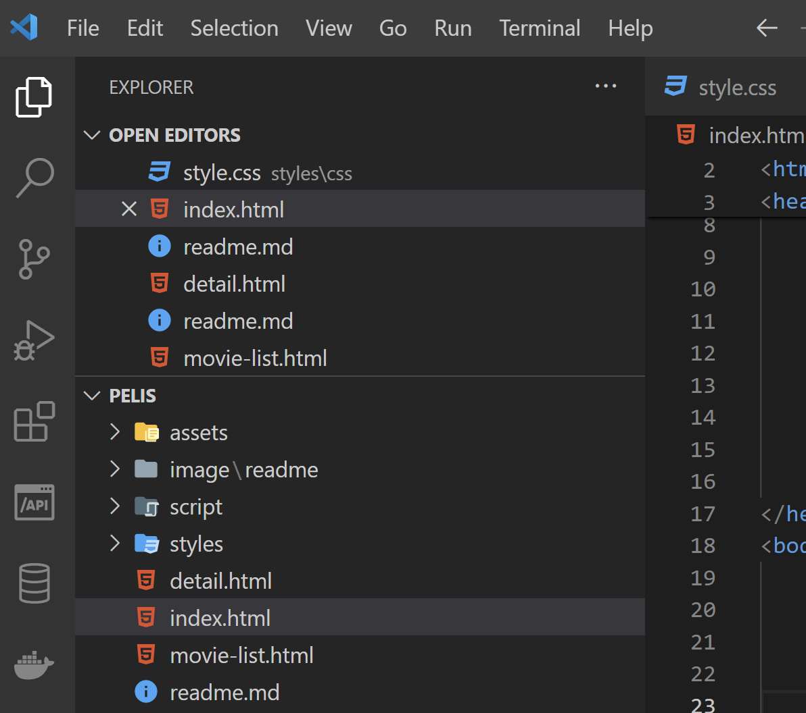
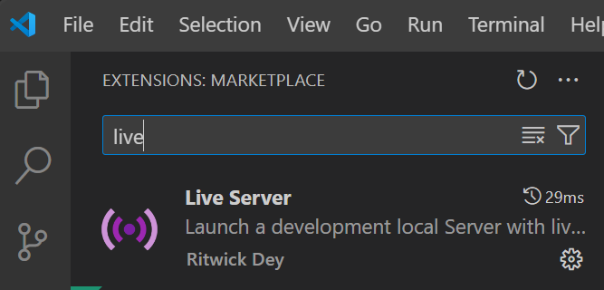
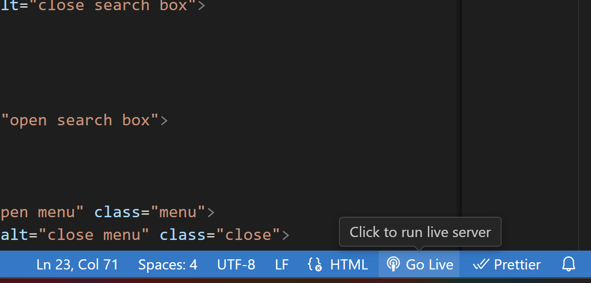

# Instrucciones de la Página de Streaming Cine Onix

Página de catalofgo de películas.

Instrucciones de Uso

1. **Descargar y Descomprimir** : Descarga la carpeta y descomprímela.
2. **Abrir en Visual Studio Code** : Abre la carpeta del proyecto utilizando Visual Studio Code (VS Code). Asegurate de abrir el Visual Code desde los archivos.

5. **Instalar Extensión Live Server** : Antes de iniciar la página, necesitarás instalar la extensión "Live Server" en Visual Studio Code. Puedes encontrar esta extensión en la tienda de extensiones de VS Code.

   
6. **Iniciar Live Server** : Una vez instalada la extensión, busca el botón "Go Live" en la esquina inferior derecha de la interfaz de VS Code y haz clic en él. Esto iniciará un servidor local y abrirá la página en tu navegador web predeterminado.

5. **Explorar la Página** : Una vez que la página se haya cargado en tu navegador, puedes explorar las diferentes secciones, como las películas populares, próximos estrenos y más. Utiliza la barra de búsqueda para buscar películas específicas.
